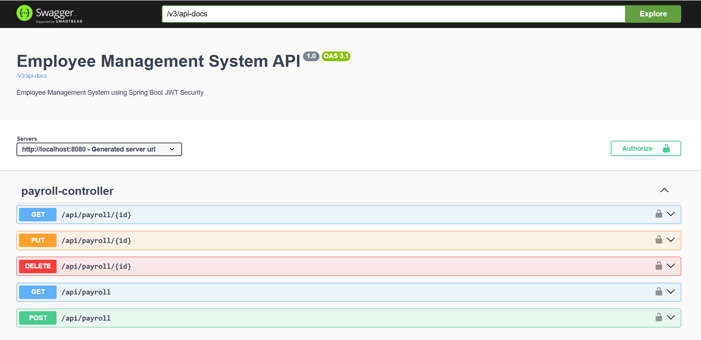
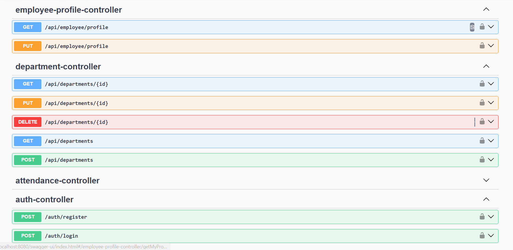
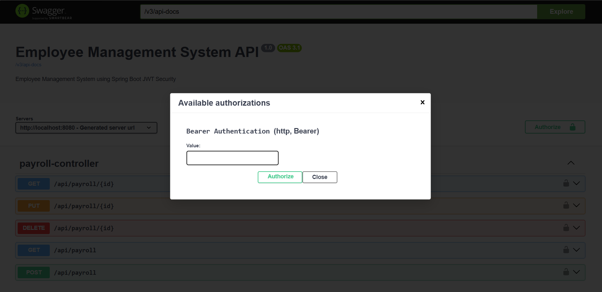
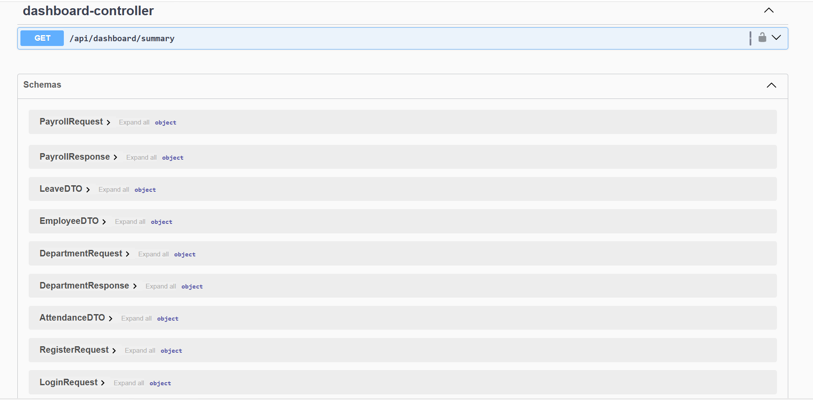
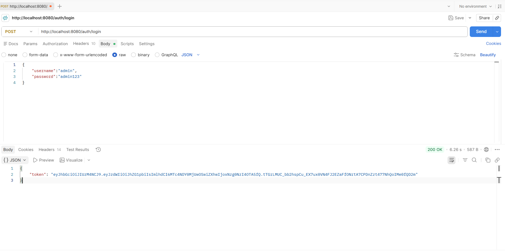

# 🚀 Employee Management System

# 🚀 Employee Management System

A **backend REST API for employee management** developed using **Java 21 and Spring Boot 3**, with **Spring Security, JWT authentication, Spring Data JPA, Hibernate, and MySQL**.

The system provides secure and structured APIs for managing **employees, departments, attendance, leave, payroll, and dashboard analytics**. It implements **role-based access control (RBAC), BCrypt password encryption, Bean Validation, global exception handling, and Swagger/OpenAPI documentation**, following a **layered Controller–Service–Repository architecture**.

---

## ✨ Features

* 🔐 JWT Authentication & RBAC
* 👥 Employee CRUD
* 🏢 Department CRUD
* 📅 Attendance Tracking
* 🌴 Leave Management
* 💰 Payroll Management
* 📊 Dashboard Analytics
* 🔒 BCrypt Password Encryption
* ✅ Bean Validation & Global Exception Handling
* 📖 Interactive Swagger/OpenAPI Documentation
* 🧱 Layered Architecture (Controller → Service → Repository)

---

## 🛠 Tech Stack

| Category      | Technology                  |
| ------------- | --------------------------- |
| Language      | Java 21                     |
| Framework     | Spring Boot 3               |
| Security      | Spring Security + JWT       |
| Database      | MySQL                       |
| ORM           | Spring Data JPA + Hibernate |
| Documentation | Swagger / OpenAPI           |
| Build Tool    | Maven                       |
| Testing       | Swagger UI & Postman        |

---

## 🏗 Architecture

```text
Client
   │
Swagger UI / Postman
   │
Spring Security (JWT)
   │
Controller
   │
Service
   │
Repository
   │
MySQL
```

---

## 🚀 Getting Started

### Clone the repository

```bash
git clone https://github.com/leelamotakatla-08/employee-management-system.git
cd employee-management-system
```

### Create the database

```sql
CREATE DATABASE employee_management;
```

### Configure environment variables

```properties
SPRING_DATASOURCE_URL=jdbc:mysql://localhost:3306/employee_management
SPRING_DATASOURCE_USERNAME=root
SPRING_DATASOURCE_PASSWORD=your_password
JWT_SECRET=your_secure_secret_key
JWT_EXPIRATION=86400000
```

### Build and run

```bash
./mvnw clean install
./mvnw spring-boot:run
```

### Local Swagger

```text
http://localhost:8080/swagger-ui/index.html
```

---

## 📸 Screenshots

| Swagger UI | API Schemas |
|------------|-------------|
|  |  |

| JWT Authentication | Dashboard APIs |
|--------------------|----------------|
|  |  |

| Postman Testing |
|-----------------|
|  |
---

## 💡 Skills Demonstrated

* Java 21
* Spring Boot
* Spring Security (JWT)
* REST API Development
* Spring Data JPA & Hibernate
* MySQL
* Bean Validation & Exception Handling
* Swagger/OpenAPI
* Git & GitHub

---

## 👩‍💻 Author

**Motakatla Leela Vardhini**

🎓 B.Tech – Computer Science & Engineering

💻 Aspiring Software Developer

---

⭐ **If you found this project useful, consider giving it a Star on GitHub!**
